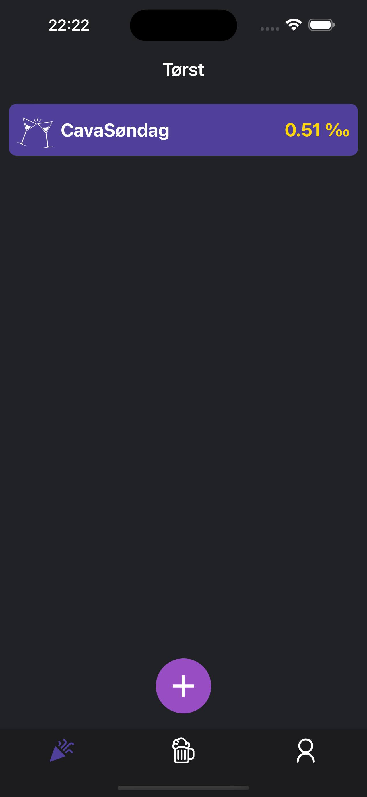
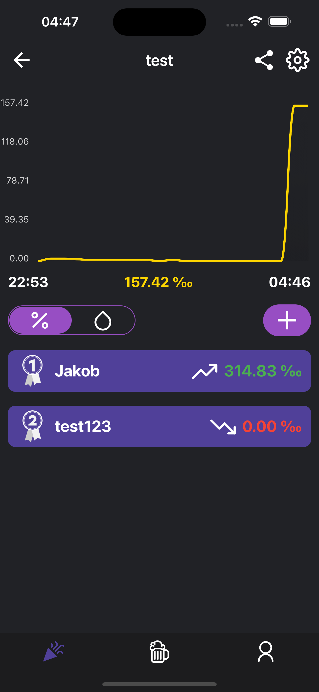
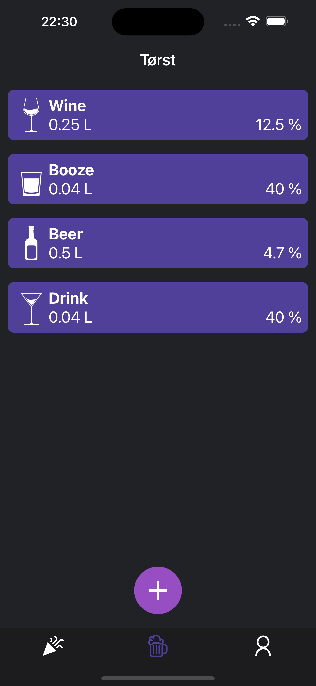
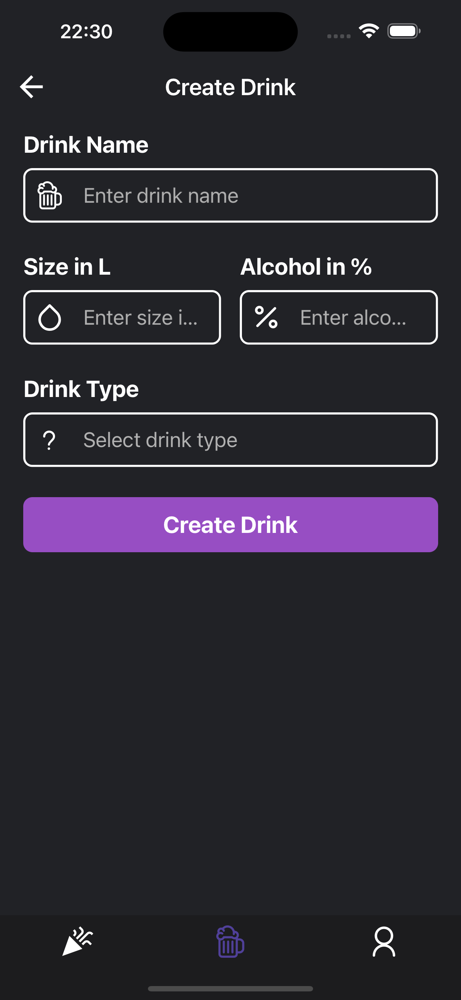
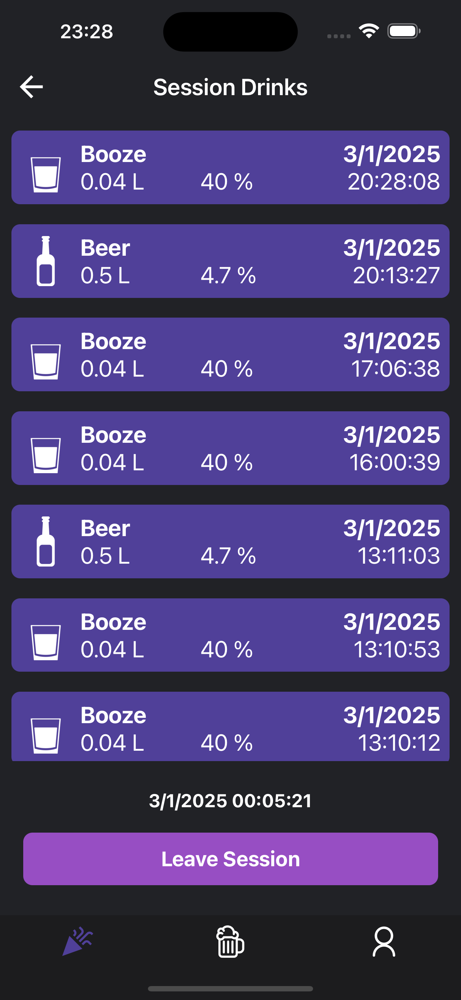

# Torst

This readme-file describes contents, navigation and necessary versions and dependencies to run Torst on an iOS simulator.

## Description

Welcome to Torst, the app that makes tracking your drink sessions easy, fun, and insightful! Whether you're hosting a party, having a pre-party with your friends, or simply enjoying a night out, Torst helps you monitor and manage your blood alcohol level.

## Contents

The code project is found in [src](/src/). The project consists of the following

- [src/components](/src/components/) contains reusable components rendered across different screens
- [src/config](/src/config/) includes configuration files for the project
- [src/context](/src/context/) provides context files for state management across the app
- [src/navigation](/src/navigation/) manages the navigation between screens and includes various navigation stacks
- [src/screens](/src/screens/) contains the individual screens for the app
- [src/styles](/src/styles/) defines the theme colors and global styles for the app
- [src/utilities](/src/utilities/) includes utility functions, such as the logic for calculating BAC levels

## Required versions and dependencies

This project requires the following dependencies and versions:

- **[Expo](https://expo.dev/):** 51.0.31 
- **[Node](https://nodejs.org/en):** 20.18.0
- **[React](https://react.dev/):** 18.2.0  
- **[React Native](https://reactnative.dev/):** 0.74.5  
- **[Firebase](https://firebase.google.com/):** 10.14.1  
- **[TypeScript](https://www.typescriptlang.org/):** 10.14.1  

For a full list of dependencies, refer to the [package.json](/package.json) file.

## Install iOS simulator

Follow the steps provided in this [guide](https://docs.expo.dev/workflow/ios-simulator/) to install the simulator for running the project.

## Set up Firebase

This project uses Firebase for data handling. First you need to create a new project nad follow these steps to set up the backend service:

- Set up a **[Cloud Firestore Database](https://firebase.google.com/docs/firestore)** with the following collections; `users`, `drinks` and `sessions`.
- Add **[Firebase Authentification](https://firebase.google.com/docs/auth)** with an Email/Password provider. 
- Add a **[Web App](https://firebase.google.com/docs/web/setup)** and copy the `firebaseConfig` into the [app.json](/app.json) file below the `extra` section. 

## Run project

- To install all the dependencies, run `npm install`
- To launch the Expo development server and run the application, run `npx expo start`

## Screenshots

  
  
  
  
  

